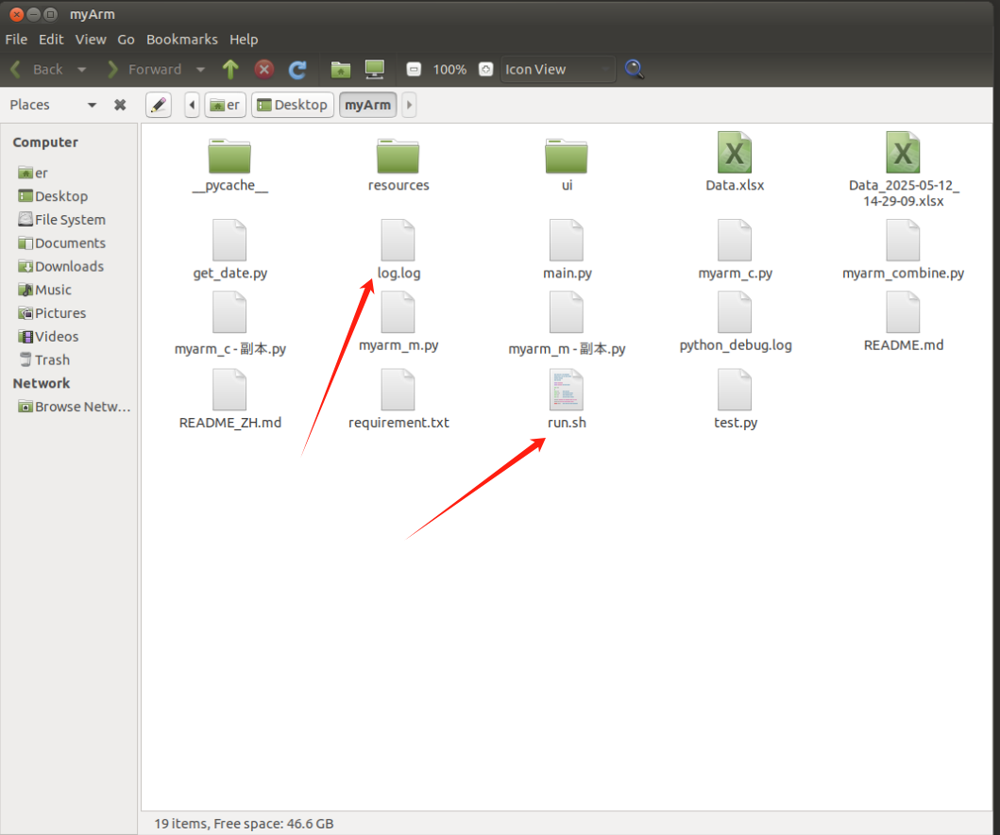
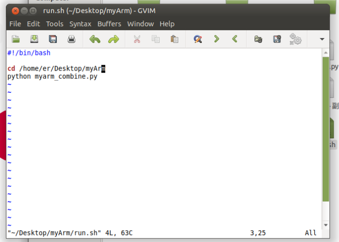
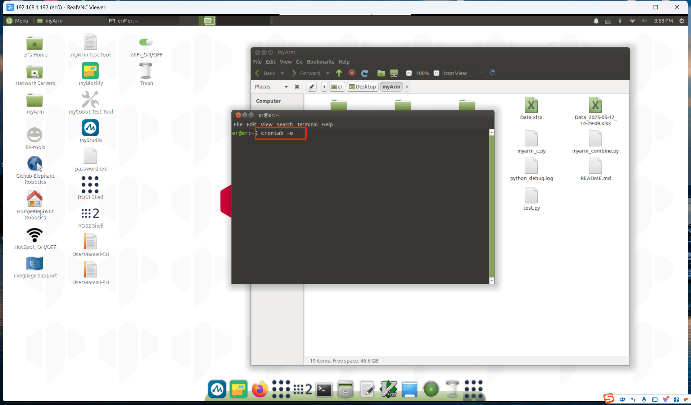
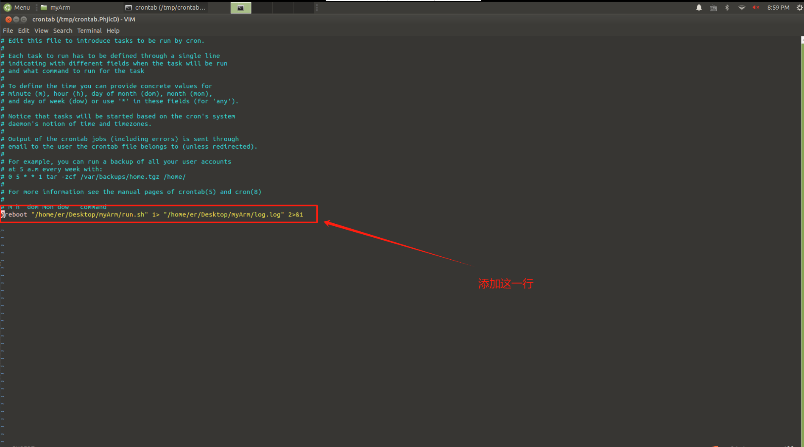

# 使用方法
## 硬件设备：一台MyArmM750，一台MyArmC650，一个树莓派的开发板
1. 先将MyArm C650和MyArm M750上电并连接树莓派
2. 给树莓派上电等待30-40秒左右即可（开机实现自启动程序）
3. 按下MyArm C650末端的红色按钮，即可执行摇操程序
4. 按下MyArm C650末端的蓝色按钮，即可执行循环夹取木块旋转位置的程序

**注：** 在执行其中一个程序的过程中按下另一个按钮，程序会直接切换成对应的程序。

------------------------------------------------------------------------
## 实现开机自启动程序
1. 先将程序放在树莓派的桌面上

2. 进入文件夹myArm创建一个log.log文件和run.sh文件

3. 在run.sh文件中添加以下内容（保存之后记得给文件权限）

4. 在终端中输入以下命令，将run.sh文件添加到开机自启动

5. 保存退出之后可以输入reboot重启树莓派即可

